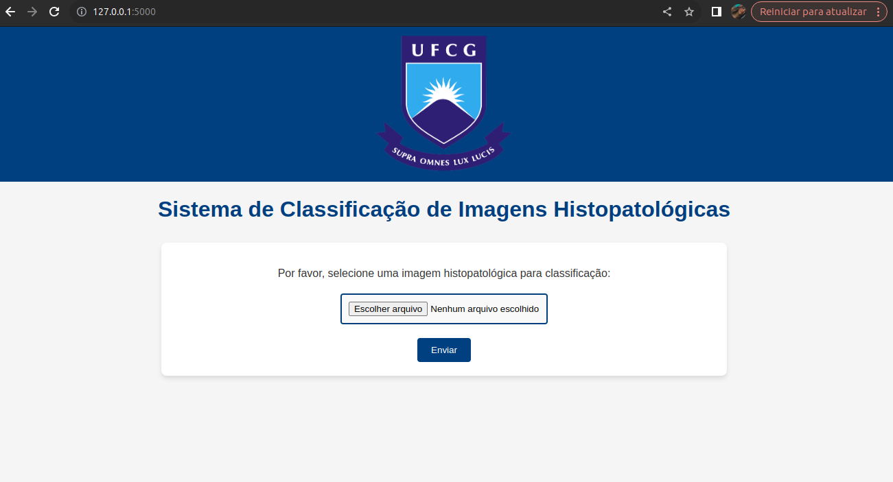
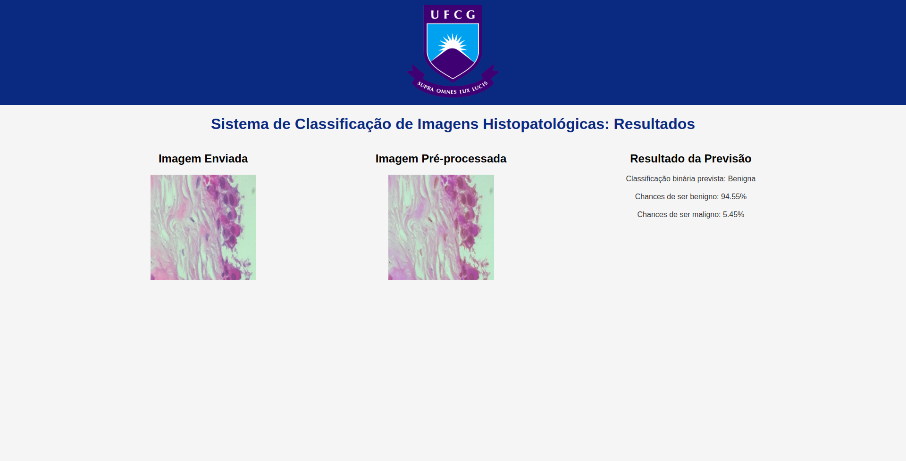

# HistopathMammoML

HistopathMammoML é um aplicativo web interativo desenvolvido para classificar imagens histopatológicas de câncer de mama. Utilizando um modelo de aprendizado profundo pré-treinado (VGG-16), o aplicativo permite o envio imagens para análise automática, ajudando no suporte ao diagnóstico de câncer de mama.

## Funcionalidades

- Envio de imagens histopatológicas para análise.
- Pré-processamento das imagens submetidas.
- Classificação automática entre benigno e maligno.
- Exibição dos resultados, incluindo:
  - Imagem original enviada.
  - Imagem pré-processada.
  - Classificação (benigno/maligno).
  - Probabilidade associada ao resultado.

## Pré-requisitos

- **Python 3.x** instalado.
- Dependências do projeto listadas no arquivo `requirements.txt`.

## Instalação

### 1. Clone o repositório

```bash
git clone https://github.com/bianccac/HistopathMammoML.git
cd HistopathMammoML
```
### 2. Crie um ambiente virtual (opcional, mas recomendado)
```bash
python -m venv venv
```

#### Ative o ambiente virtual:

- No Windows:
``` bash
venv\Scripts\activate
```

- No Linux/MacOS:
``` bash
source venv/bin/activate
```

### 3. Instale as dependências
``` bash
pip install -r requirements.txt
```

### 4. Execute o aplicativo
```bash
python app.py
```
### 5. Acesse no navegador
Após iniciar o servidor, abra o navegador e acesse o seguinte endereço:

- http://127.0.0.1:5000

## Uso

1. **Envio de imagens**: Após acessar a interface do aplicativo, envie uma imagem histopatológica de câncer de mama no formato `.jpg` ou `.png`.
2. **Classificação**: O aplicativo irá pré-processar a imagem e rodar o modelo de classificação.
3. **Resultados**: O sistema exibirá a imagem original, a imagem pré-processada, o resultado da classificação (benigno ou maligno) e a probabilidade associada ao diagnóstico.

### Exemplo de uso

Após fazer o upload da imagem, o aplicativo processa a imagem e exibe o resultado na mesma tela, como no exemplo abaixo:


*Figura 1: Interface de upload de imagens.*

O resultado inclui a imagem original, a imagem pré-processada e a classificação (benigno ou maligno), com a probabilidade associada:


*Figura 2: Resultado da classificação mostrando a imagem original e o resultado da previsão.*

## Estrutura do projeto

- `app.py`: Arquivo principal que inicia o servidor Flask.
- `model/`: Contém o modelo treinado `modelvgg.h5` que faz a classificação das imagens.
- `static/`: Arquivos estáticos, como CSS e JavaScript.
- `templates/`: Arquivos HTML usados para renderizar as páginas web do aplicativo.
- `docs/`: Contém as imagens usadas na documentação (como screenshots do aplicativo).

## Licença

Este projeto está licenciado sob os termos da licença MIT. Consulte o arquivo [LICENSE](LICENSE) para mais detalhes.

## Contato

Desenvolvido por [Biancca Cavalcante de Almeida Bezerra](https://github.com/bianccac).

Se você tiver dúvidas ou quiser contribuir para o desenvolvimento deste projeto, sinta-se à vontade para entrar em contato!
